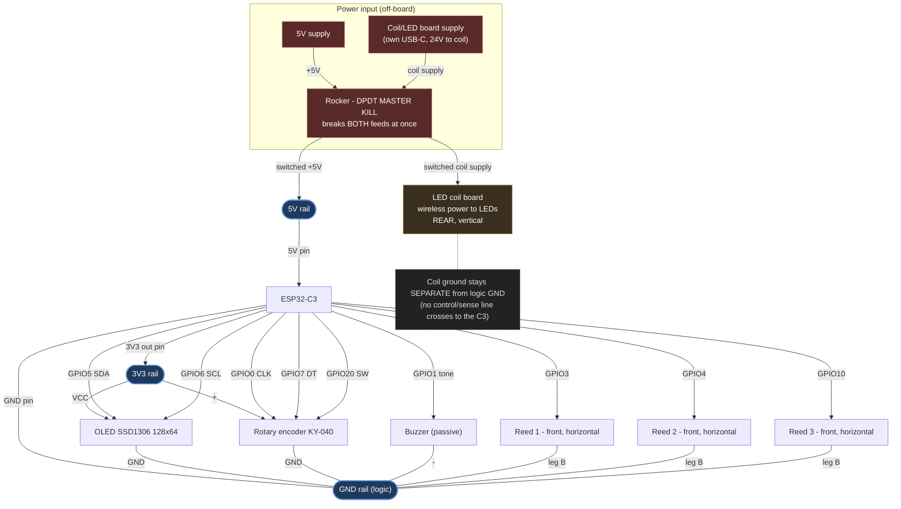

# Circuit & power

Power, grounding and wiring for the bench build. The GPIO **pin map** lives in
[CLAUDE.md](../CLAUDE.md#hardware--pin-map-esp32-c3-super-mini-native-usb); this
doc covers how it's powered and the high-power (LED coil) domain.

## Power & the master switch

- **One DPDT rocker = master kill.** Pole 1 breaks the +5V logic feed; pole 2
  breaks the coil/LED board's supply — so OFF cuts *everything* and never leaves
  the coil warm. Switch the coil board on its **DC input** (or the supply's
  mains), not inside a USB-C cable. If the coil current is more than a rocker
  should carry, let the rocker drive a **relay/SSR** on the 24V side and keep the
  switch itself low-current.
- **Don't double-feed 5V.** For dev, power the C3 from **USB-C only**; in
  deployment, from the switched **5V pin** — not both at once unless the Super
  Mini has OR-ing diodes (most don't), or you'll back-feed two 5V sources.

## Grounding

- Logic peripherals (OLED, encoder, buzzer, reeds) return to **one logic GND
  rail**; the C3's GND pin ties that rail to its regulator ground.
- The **coil/LED board is its own power domain** with its own supply, and **no
  signal crosses** to the C3 — so its ground is kept **separate** (not bonded to
  logic GND). That keeps coil/LED switching noise out of the I²C and the reeds.
  *If* you ever add a C3→coil control or sense line, bond the two grounds at
  exactly one point (a star) at that time.

## LED coil vs. reed switches

- Reed switches are **magnetic** sensors, so an energized coil is the one real
  risk to the core sensing. Mitigated here by geometry: coil is **vertical at the
  rear**, reeds are **horizontal at the front** — separated, with the field axis
  roughly perpendicular to the reed axes.
- **Bench-check:** energize the coil and bring it toward the reeds while watching
  **Settings → Hardware Test** — confirm no false trips.
- Confirm the coil board has a **flyback diode / snubber** across the coil. Run
  the coil leads as a **twisted pair**, routed away from the I²C and reed wiring.

## Decoupling

- With the coil nearby, add bulk + HF caps on both rails (≈**100 µF + 100 nF** on
  5V and on 3V3, near the C3). A small cap across a reed line helps if one proves
  noisy.

## Logic peripherals (3V3 domain)

- OLED + encoder run from the C3's **3V3-out** pin (small load — fine for the
  onboard LDO). Everything logic-side is 3V3, so there's **no level shifting**.
  The KY-040's pull-ups go to 3V3 (not 5V), keeping the GPIOs safe.
- Pin choices avoid the C3 **strapping pins** (GPIO2/8/9) and the **USB** pins
  (GPIO18/19). Note GPIO20 is UART0-RX by default but free here because the
  console runs over **USB-CDC**.
